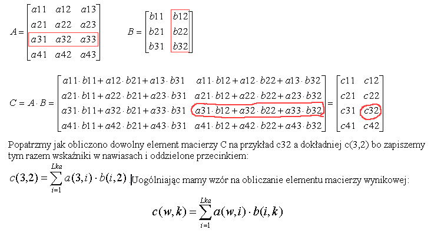

Objaśnienia
Mnożenie macierzy
Używane w różnych modelach matematycznych układy równań o regularnej budowie mogą być wygodnie i krótko zapisywane w postaci macierzowej. Przy ich formułowaniu i rozwiązywaniu stosuje się operacje macierzowe a jedną z nich jest mnożenie. W działaniu tym wyznaczane są sumy iloczynów par zawierających element wiersza macierzy pierwszej i element kolumny macierzy drugiej. Wynika stąd warunek wykonalności mnożenia macierzy:
jeśli mamy macierz A(Lwa,Lka) o Lwa wierszach i Lka kolumnach i analogicznie mamy macierz B(Lwb,Lkb) to:

liczba elementów w wierszu pierwszej macierzy musi być równa liczbie elementów w kolumnie drugiej macierzy czyli Lka=Lwb.

Elementy będą powstawać niejako na przecięciach wierszy A z kolumnami B a więc macierz wynikowa C(Lwa,Lkb) będzie miała Lwa wierszy i Lkb kolumn
Konkretnie dla macierzy A(4,3) B(3,2) mnożenie jest możliwe bo Lka=Lwb=3 a macierzą wynikową będzie C(4,2)
Oto przykład obliczania macierzy C która ma powstać jako iloczyn macierzy A i B:

